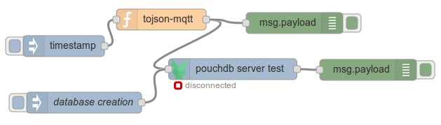

node-red-node-pouchdb
=====================
 Node-Red (http://nodered.org) nodes for accesse Nosql database via pouchdb (http://pouchdb.com/)
 simple access works in this version with pouchdb-server (https://github.com/pouchdb/pouchdb-server) or apache couchdb database (http://couchdb.apache.org/)
 not tested with local pouchdb database !! help appreciated..

Install
-------
todo : npm install
actually

	cd <yourapplication>/node_modules
	git clone https://github.com/michelcourbon/node-red-contrib-pouchdb.git
	cd node-red-contrib-pouchdb
	npm install

Usage
-----
* topic="database" create or change database
* topic empty or other! send the payload to server with post method (id auto-created by database)

the payload must contain database name as string.. or the json object to save into database

be carefull.. at startup databse name is'nt verified..

the visual status is active... so you can see if error or not, without debug message
if node-red start and the database server isn't active.. error; but you can start the db server and the node work without restart node-red... 

Example
-------
if you want try it, the 2 possibilities in the node 

the flow text to import into your node-red
	[{"id":"8d53fad9.217c08","type":"debug","z":"1e25904c.4569e","name":"","active":true,"console":"false","complete":"false","x":432,"y":55,"wires":[]},{"id":"a2fad7c9.f51158","type":"inject","z":"1e25904c.4569e","name":"","topic":"","payload":"","payloadType":"date","repeat":"","crontab":"","once":false,"x":103,"y":88,"wires":[["97531f7f.4a29"]]},{"id":"ef2551ce.5d1cc8","type":"pouchdbaccess","z":"1e25904c.4569e","name":"pouchdb server test","server":"http://127.0.0.1:5984","database":"test","x":344,"y":121,"wires":[["72447dc.f019784"]]},{"id":"97531f7f.4a29","type":"function","z":"1e25904c.4569e","name":"tojson-mqtt","func":"msg.payload={\"time\":msg.payload,\"topic\":\"/home/temp\",\"value\":12.3};\n\nreturn msg;","outputs":1,"noerr":0,"x":242,"y":50,"wires":[["ef2551ce.5d1cc8","8d53fad9.217c08"]]},{"id":"72447dc.f019784","type":"debug","z":"1e25904c.4569e","name":"","active":true,"console":"false","complete":"false","x":537,"y":122,"wires":[]},{"id":"650c5fed.8d6198","type":"inject","z":"1e25904c.4569e","name":"database creation","topic":"database","payload":"test2","payloadType":"string","repeat":"","crontab":"","once":false,"x":132,"y":169,"wires":[["ef2551ce.5d1cc8"]]}]

Authors
-------
Michel 

